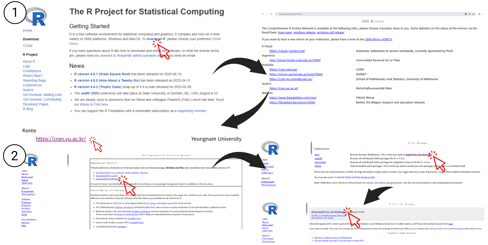
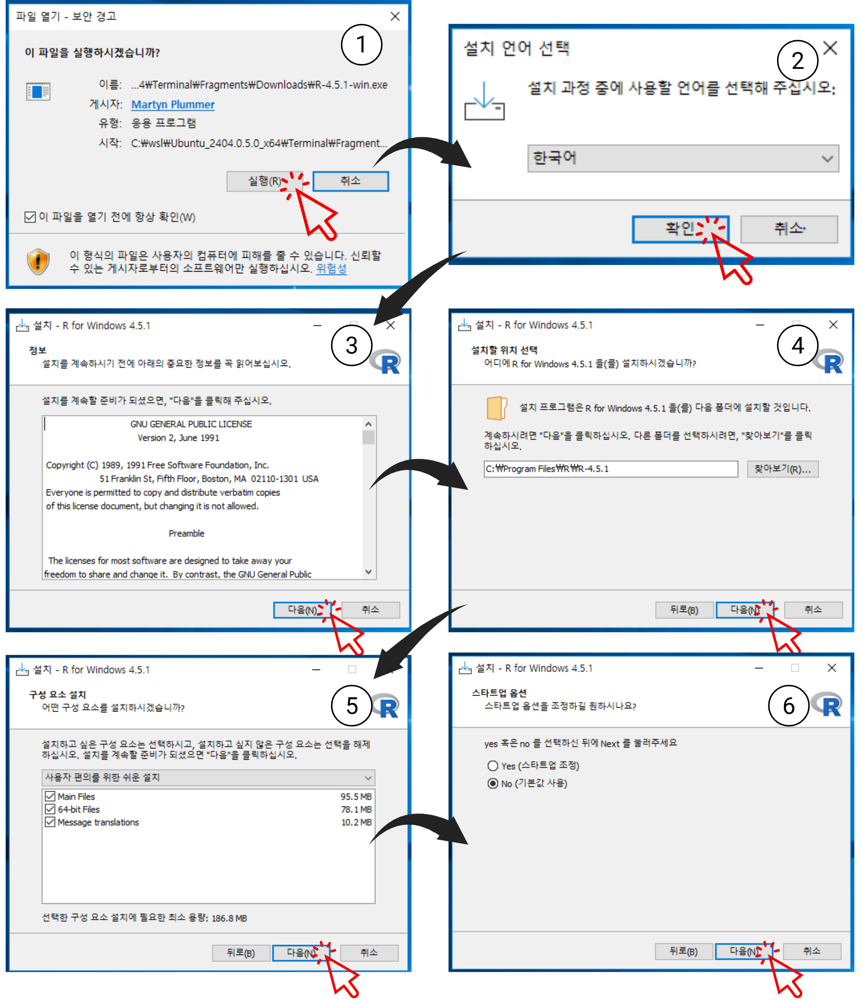
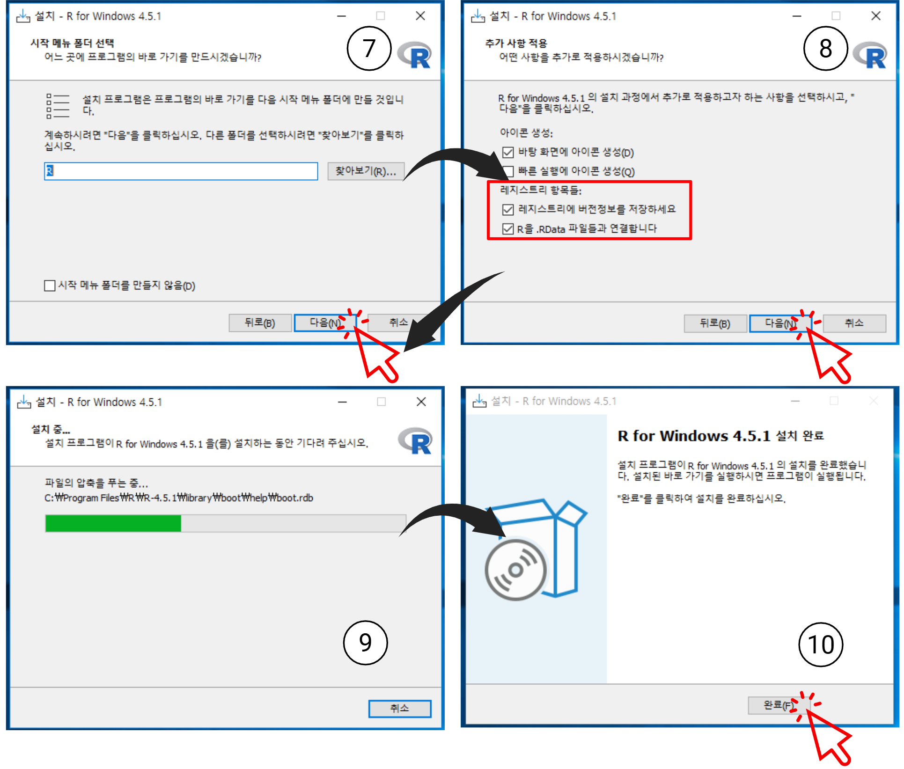
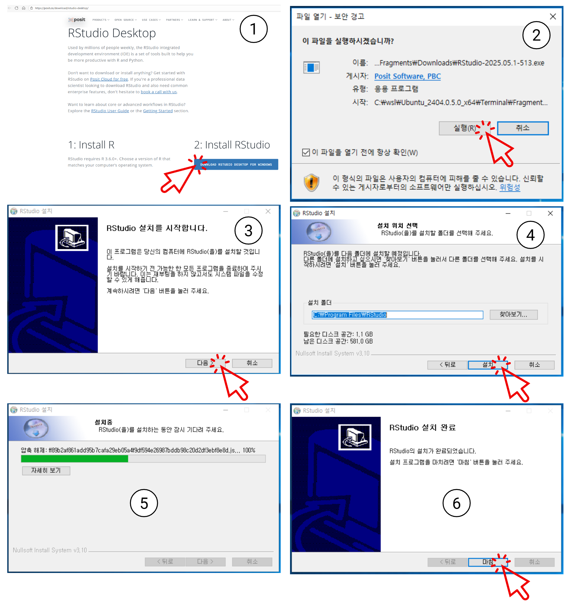
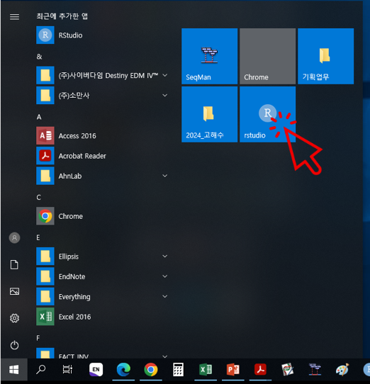
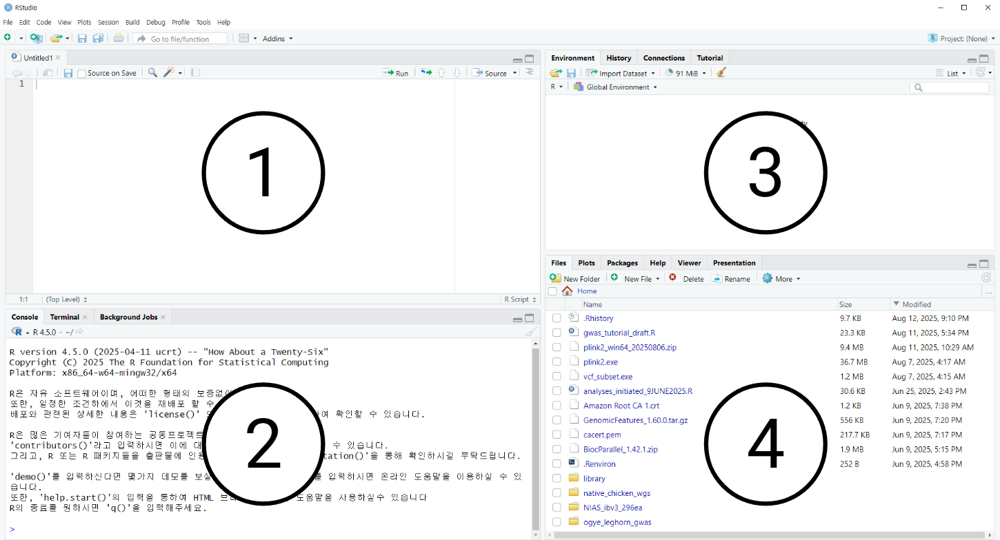
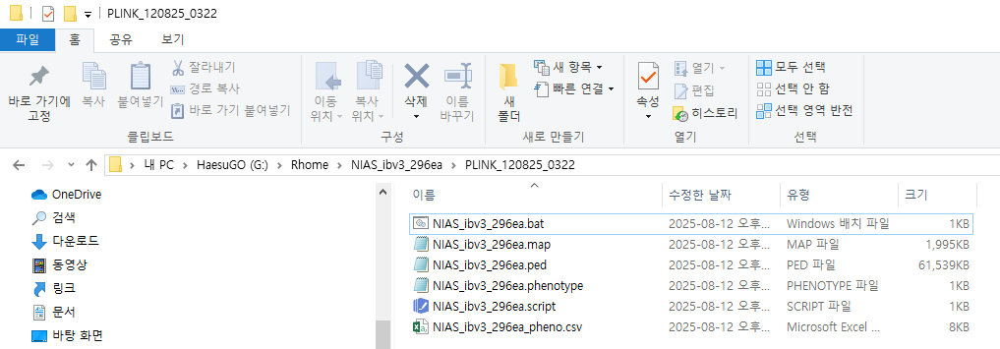
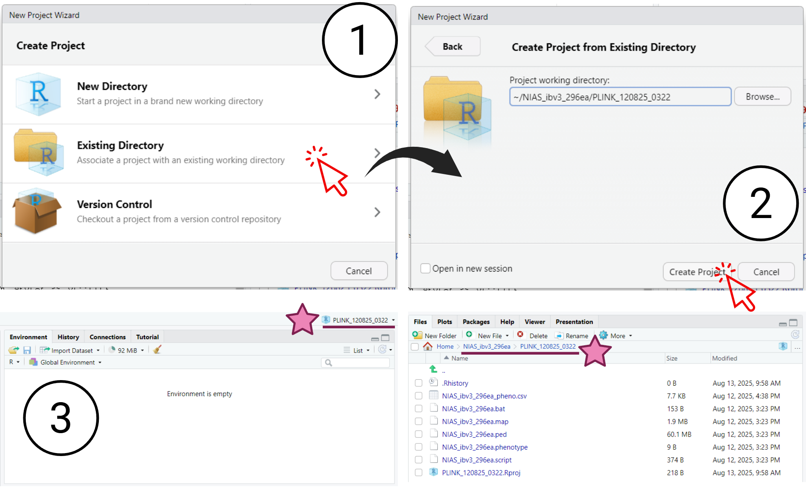
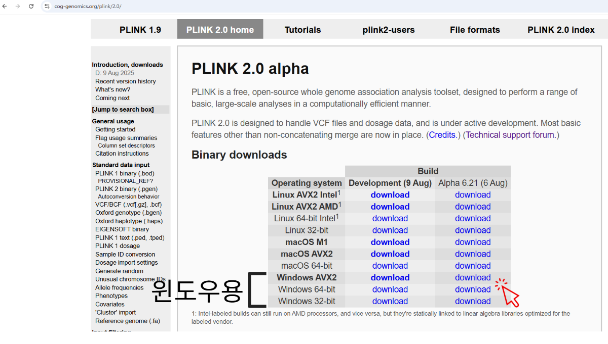
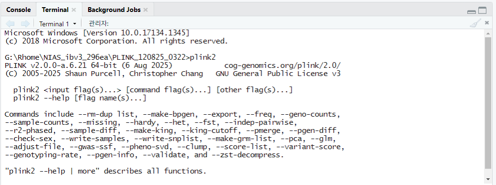

# 저자 정보 {-}

이 문서는 **국립축산과학원 가축개량평가과**의 **고해수 박사**가 작성하였습니다.

- **소속:** 국립축산과학원 가축개량평가과
- **이메일:** kosoo91@korea.kr

이 문서에 대한 질문이나 제안 사항이 있으시면 위 이메일로 연락 주시기 바랍니다.

<br>

---

```{r, include=FALSE}
knitr::opts_chunk$set(echo = TRUE, message = FALSE, warning = FALSE, comment = "#>")
```

# GWAS 분석 사전 준비 절차

개요

```{=html}
<div class="og-timeline" style="position:relative; margin:1rem 0 1.2rem;">
  <div class="og-line"></div>

  <div class="og-node">
    <span class="og-dot"></span>
    <div class="og-card"><strong>GenomeStudio PLINK 플러그인</strong> 설치 → <code>.bsc → .ped/.map</code> 파일 변환</div>
  </div>

  <div class="og-node">
    <span class="og-dot"></span>
    <div class="og-card"><strong>R / RStudio</strong> 설치 및 시작 화면 고정</div>
  </div>

  <div class="og-node">
    <span class="og-dot"></span>
    <div class="og-card"><strong>RStudio 레이아웃</strong>과 패널별 역할 파악</div>
  </div>

  <div class="og-node">
    <span class="og-dot"></span>
    <div class="og-card"><strong>R Project</strong> 생성 & 작업 디렉토리 고정</div>
  </div>

  <div class="og-node">
    <span class="og-dot"></span>
    <div class="og-card"><strong>plink2</strong> 다운로드·PATH 등록·RStudio 터미널 확인</div>
  </div>

  <div class="og-node">
    <span class="og-dot"></span>
    <div class="og-card">필요 <strong>R 패키지</strong> 일괄 설치/로딩</div>
  </div>
</div>

<style>
  .og-line{
    position:absolute; left:8px; top:0; bottom:0;
    width:2px; background:#e2e6ea;
  }
  .og-node{ position:relative; padding-left:2rem; margin:.75rem 0; }
  .og-dot{
    position:absolute; left:0; top:.35rem; width:.9rem; height:.9rem;
    background:#fff; border:2px solid #0d6efd; border-radius:999px;
    box-shadow:0 0 0 3px rgba(13,110,253,.08);
  }
  .og-card{
    border:1px solid #e2e6ea; border-radius:10px; padding:.55rem .7rem; background:#fcfcff;
  }
</style>

```

## Genotype data (유전자형 데이터) 준비
<p style="font-size:1.1rem; line-height:1.85;">
  <strong>입력 파일(.bsc)</strong>을 <strong>GenomeStudio의 PLINK 플러그인</strong>을 이용하여
  <strong>최종 산출물(.ped, .map)</strong>로 변환시키는 과정이 필요하다.
</p>

```{=html}
<div id="gwas-flow" style="max-width:900px;margin:1rem auto">
  <svg viewBox="0 0 900 520" width="100%" role="img" aria-label="GWAS PLINK 변환 흐름도">
    <defs>
      <marker id="arrow" markerWidth="10" markerHeight="10" refX="8" refY="5" orient="auto" markerUnits="strokeWidth">
        <path d="M0,0 L10,5 L0,10 Z"></path>
      </marker>
      <style>
        .box{rx:12; ry:12; stroke-width:2;}
        .box.gray{fill:#e9ecef; stroke:#adb5bd;}
        .box.blue{fill:#cfe2ff; stroke:#0d6efd;}
        .box.green{fill:#d1e7dd; stroke:#198754;}
        .edge{stroke:#495057; stroke-width:2; fill:none; marker-end:url(#arrow);}
        .label{font-family:-apple-system, Segoe UI, Roboto, "Noto Sans KR", Arial, sans-serif; font-size:16px; font-weight:600;}
        .small{font-size:14px; font-weight:500;}
        .cluster{fill:#f8f9fa; stroke:#ced4da; stroke-width:1.5;}
        .cluster-title{font-family:-apple-system, Segoe UI, Roboto, "Noto Sans KR", Arial, sans-serif; font-size:16px; font-weight:700;}
      </style>
    </defs>

    <!-- 클러스터(서브그래프) -->
    <rect x="40" y="40" width="820" height="440" class="cluster" />
    <text x="50" y="70" class="cluster-title">목표: PLINK 파일 형식으로 유전자형 데이터 변환</text>

    <!-- 노드 -->
    <!-- A -->
    <rect x="320" y="110" width="260" height="60" class="box gray"/>
    <text x="450" y="145" class="label" text-anchor="middle">NIAS_ibv3_296ea.bsc</text>

    <!-- B -->
    <rect x="300" y="220" width="300" height="80" class="box blue"/>
    <text x="450" y="250" class="label" text-anchor="middle">GenomeStudio</text>
    <text x="450" y="272" class="small" text-anchor="middle">PLINK 플러그인</text>

    <!-- C -->
    <rect x="150" y="360" width="280" height="70" class="box green"/>
    <text x="290" y="390" class="label" text-anchor="middle">.ped 파일</text>
    <text x="290" y="412" class="small" text-anchor="middle">유전자형 데이터</text>

    <!-- D -->
    <rect x="470" y="360" width="280" height="70" class="box green"/>
    <text x="610" y="390" class="label" text-anchor="middle">.map 파일</text>
    <text x="610" y="412" class="small" text-anchor="middle">마커 위치 데이터</text>

    <!-- 연결선 -->
    <path class="edge" d="M450,170 L450,220"/>
    <path class="edge" d="M450,300 L290,360"/>
    <path class="edge" d="M450,300 L610,360"/>
  </svg>
</div>
```

```{=html}
<section class="rd-card" id="plugin-install">
  <div class="rd-card__header">
    <span class="rd-chip">1.1</span>
      PLINK Input Report Plug-in v2.1.4 다운로드 및 설치
  </div>
  <div class="rd-card__body">
    <p class="rd-note">
      아래 링크에서 플러그인을 내려받아 설치한다.
    </p>

    <p>
      <strong>사이트 접속:</strong>
      <a href="https://sapac.support.illumina.com/downloads/genomestudio-2-0-plug-ins.html"
         target="_blank" rel="noopener">
        https://sapac.support.illumina.com/downloads/genomestudio-2-0-plug-ins.html
      </a>
      <a class="rd-link-btn" href="https://sapac.support.illumina.com/downloads/genomestudio-2-0-plug-ins.html"
         target="_blank" rel="noopener">사이트 열기</a>
    </p>

 <!-- ▼ 여기 이미지 블록을 추가 -->
   <figure style="margin:1rem 0; text-align:center;">
  
  <figcaption style="font-size:.95rem; color:#6c757d; margin-top:.35rem;">
    그림 1. GenomeStudio PLINK 플러그인 다운로드 페이지
  </figcaption>
</figure>
    <!-- ▲ 이미지 블록 끝 -->
    
    <div class="rd-callout warn">
      ⚠️ 다운로드에는 각자의 <strong>일루미나 계정</strong>이 필요하다.
      계정이 없으면 가입 후 진행해야한다. 
    </div>

    <h5 style="margin:.2rem 0 .3rem; font-weight:700;">설치 순서</h5>
    <ul class="rd-steps">
      <li>다운로드 받은 파일 압축을 해제</li>
      <li><code>SetupPLINKInputReport_2.1.4_GS2.msi</code> 더블 클릭 → installer 실행</li>
      <li>installer 안내에 따라 <kbd>Next</kbd> → <kbd>Next</kbd> → <kbd>Next</kbd> → <kbd>Close</kbd> 클릭</li>
    </ul>

     <!-- ▼ 여기 이미지 블록을 추가 -->
   <figure style="margin:1rem 0; text-align:center;">
  
  <figcaption style="font-size:.95rem; color:#6c757d; margin-top:.35rem;">
    그림 2. GenomeStudio PLINK 플러그인 설치 화면
  </figcaption>
</figure>
    <!-- ▲ 이미지 블록 끝 -->
    
  </div>
</section>
```

```{=html}
<section class="rd-card" id="export-plink">
  <div class="rd-card__header">
    <span class="rd-chip">1.2</span>
    GenomeStudio에서 .bsc → PLINK 파일 내보내기
  </div>

  <div class="rd-card__body">
    <p class="rd-note">
      <strong>전제: PLINK Input Report Plug-in이 설치되어 있어야 하며, GenomeStudio 프로젝트에 <code>NIAS_ibv3_296ea.bsc</code>가 로드 되어있어야 한다.</strong> <strong> <code>NIAS_ibv3_296ea.bsc</code> 파일을 더블클릭하면 된다.</strong> 
    </p>

    <h5 style="margin:.2rem 0 .3rem; font-weight:700;">내보내기 단계</h5>
    <ul class="rd-steps">
      <li><em>GenomeStudio</em> 상단 메뉴에서 <strong>Analysis → Reports → Report Wizard</strong> 를 연다.</li>
      <li><strong>Custom Report</strong> 옵션을 선택하고 <kbd>Next</kbd> 를 클릭한다.</li>
      <li><strong>Output Path</strong>(출력 경로)와 <strong>Report Name</strong>(보고서 이름)을 지정한 후 <kbd>Finish</kbd> 를 클릭한다.</li>
      <li><strong>Progress Status</strong> 진행 창이 나타나는지 확인한다.</li>
      <li>완료 후 “보고서를 볼지” 묻는 메시지가 뜨면 <strong>예(Y)</strong> 를 선택한다.  
          지정한 출력 경로가 메모장으로 열려 안내된다.</li>
    </ul>

    <!-- ▼ (선택) PLINK 파일 생성 화면 이미지 -->
    <figure style="margin:1rem 0; text-align:center;">
      
      <figcaption style="font-size:.95rem; color:#6c757d; margin-top:.35rem;">
        그림 3. GenomeStudio PLINK 플러그인/리포트 화면
      </figcaption>
    </figure>
    <!-- ▲ (선택) 이미지 끝 -->

 <h5 style="margin:.6rem 0 .3rem; font-weight:700;">생성물 확인</h5>

<!-- 상위 단계: 1,2,3 번호칩만 표시 (여기서 카운터 강제 초기화) -->
<ul class="rd-steps" style="counter-reset: step;">
  <li>표시된 <strong>출력 위치</strong>로 이동한다.</li>
  <li><strong>폴더명 규칙:</strong> <code>PLINK_분석날짜_시간</code> (예: <code>PLINK_120825_0322</code>)</li>
  <li>해당 폴더 안에 다음 파일이 생성되었는지 확인한다.</li>
</ul>

    <!-- 하위 항목: 점(•) 없이, 큰 글자, 항목 간 여백 -->
<ul class="rd-check"
    style="list-style:none; padding-left:0; margin:.35rem 0 0 0; font-size:1.1rem; line-height:1.7;">
  <li style="margin:.55rem 0;">
    <code>NIAS_ibv3_296ea.ped</code> — 유전자형 데이터
  </li>
  <li style="margin:.55rem 0;">
    <code>NIAS_ibv3_296ea.map</code> — 마커 위치 데이터
  </li>
  <li style="margin:.55rem 0;">
    <span class="muted">기타</span> <code>NIAS_ibv3_296ea.bat</code> — PLINK 분석 실행용 배치 파일
  </li>
  <li style="margin:.55rem 0;">
    <span class="muted">기타</span> <code>NIAS_ibv3_296ea.script</code> — 입력 매개변수 스크립트
  </li>
</ul>
<div class="rd-callout rd-callout--lg">
  ✅ 위 두 파일(<code>.ped</code>, <code>.map</code>)이 준비되면, 이후 PLINK/PLINK2 명령으로 본격적인 GWAS 전처리를 진행할 수 있다!
</div>
</section>
```

```{=html}
<div class="tab-container">
  <input type="radio" name="tabs" id="tab1" checked="checked">
  <label for="tab1">📄 .ped 파일</label>

  <input type="radio" name="tabs" id="tab2">
  <label for="tab2">🗺️ .map 파일</label>

  <div class="tab-content" id="content1">
  <h4>개체 유전자형 정보 (.ped)</h4>
  <ul>
    <li><strong>구조</strong>: 처음 6개 열(<code>FID</code>, <code>IID</code>, <code>PID</code>, <code>MID</code>, <code>SEX</code>, <code>PHENO</code>)은 고정 정보이며, 그 뒤로 각 마커(SNP)의 대립유전자 쌍(예: <code>A G</code>)이 반복된다.</li>
    <li><strong>구분자</strong>: 모든 값은 공백(스페이스)으로 구분되며, 헤더(제목 줄)가 없다.</li>
    <li><strong>결측치</strong>: 유전자형을 알 수 없는 경우, 대립유전자를 <code>0</code>으로 표기 (즉, <code>0 0</code>).</li>
  </ul>
</div>

<div class="tab-content" id="content2">
  <h4>마커 위치 정보 (.map)</h4>
  <ul>
    <li><strong>구조</strong>: 4개의 열로 고정되어 있다: <code>염색체 (CHR)</code>, <code>마커 ID (SNP_ID)</code>, <code>유전 거리 (CM)</code>, <code>물리적 위치 (BP)</code>.</li>
    <li><strong>구분자</strong>: 공백 또는 탭으로 구분되며, 헤더가 없다.</li>
    <li><strong>참고</strong>: <code>CHR=0</code> 또는 <code>BP=0</code>은 해당 마커의 위치 정보를 모른다는 의미.</li>
  </ul>
</div>
</div>

```

## Phenotype data (표현형 데이터) 준비
**제공된 NIAS_ibv3_296ea_pheno.csv 파일**을 이용한다. 

```{r pheno-data-image, echo=FALSE, fig.cap="표현형 데이터 파일 (NIAS_ibv3_296ea_pheno.csv)", out.width="100%"}
knitr::include_graphics("phenotype_data.png")
```

## R/Rstudio 프로그램 다운로드 및 설치

```{=html}
<section class="rd-card" id="plugin-install">
  <div class="rd-card__header">
    <span class="rd-chip">3.1</span>
      R 프로그램 다운로드 및 설치
  </div>
  <div class="rd-card__body">
    <p class="rd-note">
      먼저 데이터 분석의 핵심 엔진인 R을 설치한다. 
    </p>

    <p>
      <strong>사이트 접속:</strong>
       <a href="https://www.r-project.org/" target="_blank" rel="noopener">https://www.r-project.org/</a>
      <a class="rd-link-btn" href="https://www.r-project.org/" target="_blank" rel="noopener">R 공식 사이트 열기</a>
    </p>

 <!-- ▼ 여기 이미지 블록을 추가 -->
   <figure style="margin:1rem 0; text-align:center;">
  
  <figcaption style="font-size:.95rem; color:#6c757d; margin-top:.35rem;">
    그림 1. R 다운로드 페이지
  </figcaption>
</figure>
    <!-- ▲ 이미지 블록 끝 -->
    
  <ul class="rd-steps">
      <li>홈페이지에서 <strong>download R</strong>을 클릭하여 CRAN Mirrors 페이지로 이동.</li>
      <li>스크롤을 아래로 내려 <strong>Korea</strong> 부분을 찾고 <strong>Korea</strong> 항목 아래의 링크를 클릭.</li>
      <li><strong>Download R for Windows</strong> → <strong>install R for the first time</strong> → <strong>Download R-4.5.1 for Windows</strong>를 차례로 클릭하여 설치 파일을 내려받는다.</li>
    </ul>

  <!-- ▼ 여기 이미지 블록을 추가 -->
   <figure style="margin:1rem 0; text-align:center;">
  
  <figcaption style="font-size:.95rem; color:#6c757d; margin-top:.35rem;">
    그림 2. R 설치 화면
  </figcaption>
</figure>
    <!-- ▲ 이미지 블록 끝 -->
    
<!-- 설치 실행 안내 -->
<p class="rd-note" style="margin-top:1.2rem;">
 설치 실행 안내
</p>
<!-- 설치 단계 ②~④ -->
<ul style="list-style:none; padding-left:0; margin:.35rem 0 0 0; font-size:1.05rem; line-height:1.7;">
  <li> ① R-4.5.1-win.exe를 더블 클릭한 후 실행(R) 클릭</li>
  <li>② 설치 언어 선택 - 한국어 - 확인&nbsp;클릭</li>
  <li>③ 다음(N) 클릭</li>
  <li>④ 설치할 위치 선택 - 경로는 원하는 대로 지정 (찾아보기(R) 클릭) 가능 - 다음(N) 클릭</li>
</ul>

<!-- 주의사항은 리스트 밖 콜아웃으로 -->
<div class="rd-callout warn" style="margin:.6rem 0;">
  ※ 단, 경로 및 폴더 이름에는 <strong>한글이 없어야 한다!</strong>
</div>

<!-- 설치 단계 ⑤~⑥ -->
<ul style="list-style:none; padding-left:0; margin:.35rem 0 0 0; font-size:1.05rem; line-height:1.7;">
  <li>⑤ 다음(N) 클릭</li>
  <li>⑥ 다음(N) 클릭</li>
</ul>

  <!-- ▼ 여기 이미지 블록을 추가 -->
   <figure style="margin:1rem 0; text-align:center;">
  
  <figcaption style="font-size:.95rem; color:#6c757d; margin-top:.35rem;">
    그림 3. R 설치 화면
  </figcaption>
</figure>
    <!-- ▲ 이미지 블록 끝 -->
    
<!-- 설치 단계 ⑦~⑩ -->
<ul style="list-style:none; padding-left:0; margin:.35rem 0 0 0; font-size:1.05rem; line-height:1.7;">
  <li>⑦ 다음(N) 클릭</li>
  <li>⑧ 다음(N) 클릭</li>
  <!-- 주의사항은 리스트 밖 콜아웃으로 -->
<div class="rd-callout warn" style="margin:.6rem 0;">
  ※ <strong>레지스트리 항목들은 모두 체크</strong>되어 있어야 한다. 
</div>

  <li>⑨ 설치가 다 진행될 때까지 대기</li>
  <li>⑩ 완료(F) 클릭</li>
</ul>

</section>
```

```{=html}
<section class="rd-card" id="plugin-install">
  <div class="rd-card__header">
    <span class="rd-chip">3.2</span>
      RStudio 프로그램 다운로드 및 설치
  </div>
  <div class="rd-card__body">
    <p class="rd-note">
      다음으로 R을 더 편리하게 사용할 수 있도록 도와주는 통합 개발 환경(IDE)인 RStudio를 설치한다. 
    </p>

    <p>
      <strong>사이트 접속:</strong>
      <a href="https://posit.co/download/rstudio-desktop/" target="_blank" rel="noopener">https://posit.co/download/rstudio-desktop/</a>
      <a class="rd-link-btn" href="https://posit.co/download/rstudio-desktop/" target="_blank" rel="noopener">Posit 사이트 열기</a>
    </p>

 <!-- ▼ 여기 이미지 블록을 추가 -->
   <figure style="margin:1rem 0; text-align:center;">
  
  <figcaption style="font-size:.95rem; color:#6c757d; margin-top:.35rem;">
    그림 4. RStudio 다운로드 및 설치 화면
  </figcaption>
</figure>
    <!-- ▲ 이미지 블록 끝 -->
    
<!-- 설치 실행 안내 -->
<p class="rd-note" style="margin-top:1.2rem;">
 설치 실행 안내
</p>
<!-- 다운로드/설치 단계 ①~⑥ -->
<ul style="list-style:none; padding-left:0; margin:.35rem 0 0 0; font-size:1.05rem; line-height:1.7;">
  <li>① DOWNLOAD RSTUDIO DESKTOP FOR WINDOWS를 클릭하면 RStudio-2025.05.1.-513.exe 파일이 다운로드 된다.</li>
  <li>② RStudio-2025.05.1.-513.exe 파일을 더블클릭하여 실행(R) 클릭</li>
  <li>③ 다음(N) 클릭</li>
  <li>④ 설치 위치 선택 - 경로는 원하는 대로 지정 (찾아보기 클릭) 가능 – 설치 클릭</li>
  <li>⑤ 설치가 다 진행될 때 까지 대기</li>
  <li>⑥ 마침 클릭</li>
</ul>

</section>
```

```{=html}
<section class="rd-card" id="rstudio-pin-start">
  <div class="rd-card__header">
    <span class="rd-chip">3.3</span>
    RStudio 시작 화면 고정(바로가기)
  </div>
  <div class="rd-card__body">
    <p class="rd-note">
      설치를 마친 뒤, RStudio를 빠르게 실행할 수 있도록 Windows 시작 화면에 고정한다.
    </p>

    <ul style="list-style:none; padding-left:0; margin:.35rem 0 0 0; font-size:1.05rem; line-height:1.7;">
      <li>RStudio가 설치된 폴더로 이동하여 rstudio.exe 클릭한 후 마우스 오른쪽 버튼을 눌러 시작화면에 고정을 클릭하면 아래와 같이 시작 - rstudio 프로그램이 보인다. </li>
    </ul>

    <!-- ▼ (선택) 시작 화면 고정 결과 이미지 -->
    <figure style="margin:1rem 0; text-align:center;">
      
      <figcaption style="font-size:.95rem; color:#6c757d; margin-top:.35rem;">
        그림 5. Windows 시작 화면에 고정된 RStudio
      </figcaption>
    </figure>
    <!-- ▲ 이미지 블록 끝 -->
  </div>
</section>
```

```{=html}
<section class="rd-card" id="rstudio-ui-overview">
  <div class="rd-card__header">
    <span class="rd-chip">3.4</span>
    RStudio 기본 화면과 패널 소개
  </div>

  <div class="rd-card__body">
    <p>
      <strong>기본 화면:</strong> <code>rstudio</code>를 실행하면 아래와 같이 <strong>4개의 패널(main panes)</strong>로 구성된 기본 화면이 열린다.
    </p>
    <p class="rd-note" style="margin:.5rem 0 1rem 0;">
      <strong>패널 재설정:</strong> 메뉴에서 <em>View &gt; Panes &gt; Reset Pane Layout</em>을 선택하면 기본 레이아웃으로 재설정할 수 있다.
    </p>

    <!-- (선택) 레이아웃 예시 이미지 -->
    <!-- 이미지를 준비했다면 src 경로만 바꿔 사용하세요. 없으면 이 figure 블록을 삭제해도 됩니다. -->
    <figure style="margin:1rem 0; text-align:center;">
      
      <figcaption style="font-size:.95rem; color:#6c757d; margin-top:.35rem;">
        그림 6. RStudio 기본 레이아웃(4개 패널)
      </figcaption>
    </figure>

    <!-- ▼ 탭 컴포넌트(순수 HTML/CSS) -->
    <div class="rd-tabs" style="margin-top:1rem;">
      <!-- 탭 토글(라디오) -->
      <input type="radio" name="rstudio-tabs" id="tab-source" checked style="display:none;">
      <input type="radio" name="rstudio-tabs" id="tab-console" style="display:none;">
      <input type="radio" name="rstudio-tabs" id="tab-env" style="display:none;">
      <input type="radio" name="rstudio-tabs" id="tab-files" style="display:none;">

      <!-- 탭 헤더 -->
      <div class="rd-tabs__nav" role="tablist" aria-label="RStudio Panes" style="display:flex; gap:.5rem; flex-wrap:wrap;">
        <label for="tab-source" role="tab" aria-controls="panel-source"
               style="cursor:pointer; padding:.45rem .8rem; border:1px solid #e2e6ea; border-radius:8px;">
          ① Source Pane
        </label>
        <label for="tab-console" role="tab" aria-controls="panel-console"
               style="cursor:pointer; padding:.45rem .8rem; border:1px solid #e2e6ea; border-radius:8px;">
          ② Console / Terminal Pane
        </label>
        <label for="tab-env" role="tab" aria-controls="panel-env"
               style="cursor:pointer; padding:.45rem .8rem; border:1px solid #e2e6ea; border-radius:8px;">
          ③ Environment / History Pane
        </label>
        <label for="tab-files" role="tab" aria-controls="panel-files"
               style="cursor:pointer; padding:.45rem .8rem; border:1px solid #e2e6ea; border-radius:8px;">
          ④ Files / Plots / Packages / Help Pane
        </label>
      </div>

      <!-- 탭 콘텐츠 -->
      <div class="rd-tabs__panels" style="margin-top:.8rem;">
        <!-- Source -->
        <div id="panel-source" role="tabpanel" aria-labelledby="tab-source"
             style="display:block; border:1px solid #e2e6ea; border-radius:10px; padding:1rem;">
          <p><strong>소스 패널:</strong> 스크립트와 문서를 편집하는 영역.</p>
          <ul style="margin:.35rem 0 0 1rem; line-height:1.7;">
            <li>R 스크립트(<code>.R</code>) 편집 및 실행.</li>
            <li>다른 코드 파일(예: Python, Shell)도 탭으로 열어 편집 가능.</li>
            <li>탭 상단의 <em>Run</em>, <em>Source</em> 버튼으로 코드 실행.</li>
          </ul>
        </div>

        <!-- Console / Terminal -->
        <div id="panel-console" role="tabpanel" aria-labelledby="tab-console"
             style="display:none; border:1px solid #e2e6ea; border-radius:10px; padding:1rem;">
          <p><strong>콘솔/터미널 패널:</strong> 코드 실행 및 시스템 쉘 접근.</p>
          <ul style="margin:.35rem 0 0 1rem; line-height:1.7;">
            <li><strong>Console</strong>: R이 실제로 실행되는 곳. <code>&gt;</code> 프롬프트에서 명령을 입력하면 결과, 경고, 오류가 즉시 출력된다.</li>
            <li><strong>Terminal</strong>: RStudio 안에서 <em>명령줄(쉘)</em>을 사용할 수 있다. 기본은 Windows <em>CMD</em>이며, <em>Terminal Options</em>에서 PowerShell, Bash(WSL) 등으로 변경 가능.</li>
            <li><strong>Background Jobs</strong>: 오래 걸리는 작업을 백그라운드로 실행하고 상태/로그를 확인.</li>
          </ul>
        </div>

        <!-- Environment / History -->
        <div id="panel-env" role="tabpanel" aria-labelledby="tab-env"
             style="display:none; border:1px solid #e2e6ea; border-radius:10px; padding:1rem;">
          <p><strong>환경/기록 패널:</strong> 객체 관리와 명령 이력 확인.</p>
          <ul style="margin:.35rem 0 0 1rem; line-height:1.7;">
            <li><strong>Environment</strong>: 현재 작업 공간의 객체(변수, 데이터 프레임, 함수)를 나열. 아이템 클릭으로 미리보기 가능, <em>빗자루 아이콘</em>으로 객체 삭제 가능.</li>
            <li><strong>History</strong>: 콘솔에서 실행한 모든 명령의 로그. 검색/복사/재실행 가능.</li>
          </ul>
        </div>

        <!-- Files / Plots / Packages / Help -->
        <div id="panel-files" role="tabpanel" aria-labelledby="tab-files"
             style="display:none; border:1px solid #e2e6ea; border-radius:10px; padding:1rem;">
          <p><strong>파일/플롯/패키지/도움말 패널:</strong> 프로젝트 리소스 관리와 문서 탐색.</p>
          <ul style="margin:.35rem 0 0 1rem; line-height:1.7;">
            <li><strong>Files</strong>: 프로젝트 디렉터리 탐색, 파일 열기/관리.</li>
            <li style="margin-top:.25rem;">
              <em>기본 작업 디렉터리(Windows) 참고:</em><br>
              R과 RStudio의 홈 디렉터리(<code>~</code>)는 다음 우선순위로 결정된다:
              <code>R_USER</code> &rarr; <code>HOME</code> &rarr; 사용자 문서 폴더<br>
              예: <code>C:\Users\YourUsername\Documents</code>.
            </li>
            <li><strong>Plots</strong>: 코드로 생성된 그래프 표시. 확대/내보내기/지우기 가능.</li>
            <li><strong>Packages</strong>: 설치된 패키지 목록, 설치/업데이트, 세션 로드.</li>
            <li><strong>Help</strong>: <code>?함수이름</code> 또는 검색으로 함수/패키지 문서 확인.</li>
          </ul>
        </div>
      </div>
    </div>
    <!-- ▲ 탭 컴포넌트 끝 -->

    <!-- 기본 작업 흐름 -->
    <div style="margin-top:1.2rem;">
      <p class="rd-note">RStudio 패널에서의 기본 작업 흐름</p>
      <ol style="margin:.35rem 0 0 1rem; line-height:1.7;">
        <li>좌상단 <strong>Source Pane</strong>에서 코드 작성</li>
        <li>코드를 선택 후 <kbd>Ctrl</kbd>+<kbd>Enter</kbd> 또는 <em>Run</em>으로 실행 → 좌하단 <strong>Console</strong>에서 수행</li>
        <li>생성된 <strong>객체</strong>는 우상단 <strong>Environment</strong>에서 확인</li>
        <li><strong>그래프</strong>는 우하단 <strong>Plots</strong>에 표시, <strong>파일</strong>은 <strong>Files</strong>에서 관리</li>
      </ol>
    </div>
  </div>

  <!-- 탭 표시 토글을 위한 간단한 CSS -->
  <style>
    /* 활성 탭 라벨 하이라이트 */
    #tab-source:checked ~ .rd-tabs__nav label[for="tab-source"],
    #tab-console:checked ~ .rd-tabs__nav label[for="tab-console"],
    #tab-env:checked ~ .rd-tabs__nav label[for="tab-env"],
    #tab-files:checked ~ .rd-tabs__nav label[for="tab-files"] {
      background: #f8f9fa;
      box-shadow: 0 2px 6px rgba(0,0,0,.04);
    }

    /* 탭 패널 토글 */
    #tab-source:checked ~ .rd-tabs__panels #panel-source { display:block !important; }
    #tab-source:checked ~ .rd-tabs__panels #panel-console,
    #tab-source:checked ~ .rd-tabs__panels #panel-env,
    #tab-source:checked ~ .rd-tabs__panels #panel-files { display:none !important; }

    #tab-console:checked ~ .rd-tabs__panels #panel-console { display:block !important; }
    #tab-console:checked ~ .rd-tabs__panels #panel-source,
    #tab-console:checked ~ .rd-tabs__panels #panel-env,
    #tab-console:checked ~ .rd-tabs__panels #panel-files { display:none !important; }

    #tab-env:checked ~ .rd-tabs__panels #panel-env { display:block !important; }
    #tab-env:checked ~ .rd-tabs__panels #panel-source,
    #tab-env:checked ~ .rd-tabs__panels #panel-console,
    #tab-env:checked ~ .rd-tabs__panels #panel-files { display:none !important; }

    #tab-files:checked ~ .rd-tabs__panels #panel-files { display:block !important; }
    #tab-files:checked ~ .rd-tabs__panels #panel-source,
    #tab-files:checked ~ .rd-tabs__panels #panel-console,
    #tab-files:checked ~ .rd-tabs__panels #panel-env { display:none !important; }
  </style>
</section>

```

```{=html}
<section class="rd-card" id="rstudio-project-setup">
  <div class="rd-card__header">
    <span class="rd-chip">3.5</span>
    R Project 설정(Existing Directory)
  </div>

  <div class="rd-card__body">
    <p class="rd-note">
      <strong>R Project란?</strong> “<em>하나의 폴더 = 하나의 작업 단위(프로젝트)</em>”로 관리해 주는 기능으로, 프로젝트마다 작업 디렉토리와 설정이 자동으로 고정된다.
    </p>

    <p>
      <strong>사전 준비:</strong> 유전자형/표현형 데이터를 작업할 폴더에 구성한다(사용자마다 경로는 다를 수 있음).
    </p>

    <pre style="background:#f8f9fa; border:1px solid #e2e6ea; border-radius:8px; padding:.8rem; overflow:auto; font-size:.95rem; line-height:1.45;">
G:\Rhome\ 
└─ NIAS_ibv3_296ea\ (폴더 새로 생성)
   ├─ PLINK_120825_0322\           ← (복사)
        └─ NIAS_ibv3_296ea_pheno.csv    ← (복사)                    
        └─ ...                ← 분석 관련 파일들
    </pre>
 <!-- (선택) 작업디렉토리 및 파일 복사 이미지 -->
    <figure style="margin:1rem 0; text-align:center;">
      
      <figcaption style="font-size:.95rem; color:#6c757d; margin-top:.35rem;">
        그림 8. 작업할 디렉토리 및 파일 복사
      </figcaption>
    </figure>
    
    
    <!-- (선택) 새 프로젝트 만들기 이미지 -->
    <figure style="margin:1rem 0; text-align:center;">
      
      <figcaption style="font-size:.95rem; color:#6c757d; margin-top:.35rem;">
        그림 8. R Project 생성 화면
      </figcaption>
    </figure>

    <!-- 단계 안내 -->
    <p class="rd-note" style="margin-top:1.2rem;">설정 단계</p>
    <ul style="list-style:none; padding-left:0; margin:.35rem 0 0 0; font-size:1.05rem; line-height:1.7;">
      <li>① <strong>RStudio</strong> &rarr; <em>File &gt; New Project &gt; Existing Directory</em> 클릭</li>
      <li>② <em>Browse</em> 클릭 &rarr; <code>G:\Rhome\NIAS_ibv3_296ea\PLINK_120825_0322</code> 선택 후 <em>Open</em></li>
      <li>③ 새로 생성된 <code>.Rproj</code> 파일이 열리면서, 우하단 <em>Files/Plots/Packages/Help</em> 패널의 <em>Files</em> 탭 기준 경로(작업 디렉토리)가
          프로젝트 파일이 생성된 위치로 자동 설정된다. 프로젝트 디렉토리 이름(예: <code>PLINK_120825_0322</code>)이 프로젝트 파일명으로 자동 지정된다.</li>
    </ul>

    <!-- 팁 -->
    <div class="rd-tip" style="margin-top:1rem; border:1px solid #e2e6ea; border-radius:10px; padding:.9rem;">
      <p style="margin:0 0 .4rem 0;"><strong>작업 팁</strong></p>
      <ul style="margin:0 0 0 1rem; line-height:1.7;">
        <li>프로젝트 파일 code>.Rproj</code>를 열면 <em>working directory</em>가 자동 설정되므로, <code>setwd()</code>를 별도로 호출할 필요가 없다.</li>
        <li>데이터/스크립트/결과물을 <strong>프로젝트 폴더 내부</strong>에 두고, <strong>상대 경로</strong>(예: <code>data/file.csv</code>)를 사용하는 것이 재현성에 유리하다.</li>
        <li>프로젝트 최상단에 <code>README.md</code>나 <code>scripts/</code>, <code>data/</code>, <code>output/</code> 폴더와 같이 나눠 두면 관리가 쉬워진다.</li>
      </ul>
    </div>
  </div>
</section>

```

## plink2 프로그램 다운로드 및 설치
```{=html}
<section class="rd-card" id="plink2-install">
  <div class="rd-card__body">
    <p class="rd-note">
      <strong>목표:</strong> 최신 plink2 실행 파일을 내려받아 압축 해제 후, <em>PATH</em>에 등록하고 RStudio 터미널에서 동작을 확인한다.
    </p>
    <p>
      <strong>사이트 접속:</strong>
      <a href="https://www.cog-genomics.org/plink/2.0/" target="_blank" rel="noopener">https://www.cog-genomics.org/plink/2.0/</a>
      <a class="rd-link-btn" href="https://www.cog-genomics.org/plink/2.0/" target="_blank" rel="noopener">plink2 사이트 열기</a>
    </p>
    
    <!-- (선택) 윈도우용 plink2 다운로드 이미지 -->
    <figure style="margin:1rem 0; text-align:center;">
      
      <figcaption style="font-size:.95rem; color:#6c757d; margin-top:.35rem;">
        그림 1. 윈도우용 plink2 다운로드 페이지
      </figcaption>
    </figure>
    
 <!-- 단계 안내 ①~⑤ -->
    <ul style="list-style:none; padding-left:0; margin:.35rem 0 0 0; font-size:1.05rem; line-height:1.7;">
      <li>① <strong>https://www.cog-genomics.org/plink/2.0/</strong> 접속</li>
<li>② <em>Alpha 6.21 (6 Aug) build</em>에서 자신의 시스템에 맞는 빌드(Windows 64-bit 또는 32-bit) 클릭 → 
  <code>plink2_win64_20250806.zip</code> 파일이 다운로드된다.
  <span style="display:inline-block; margin-left:.5rem; font-size:.92rem; background:#e7f5ff; color:#0b5ed7; padding:.12rem .55rem; border-radius:999px; border:1px solid #cfe2ff;">
    참고: Alpha 6.23 (24 Aug)로 업데이트됨 (2025.9.5.기준)
  </span>
  <div style="color:#6c757d; font-size:.95rem; margin-top:.25rem;">
    최신 빌드를 선택하면 파일명이 <code>plink2_win64_20250824.zip</code>처럼 날짜가 달라질 수 있다.
  </div>
</li>
         <!-- 윈도우 시스템 종류 확인 방법 -->
    <div class="rd-tip" style="margin-top:1rem; border:1px solid #e2e6ea; border-radius:10px; padding:.9rem;">
      <p style="margin:0 0 .4rem 0;"><strong>Windows 10/11에서 시스템 종류 확인</strong></p>
      <ol style="margin:.35rem 0 0 1rem; line-height:1.7;">
        <li>시작 버튼 클릭 → <strong>⚙ 설정(Settings)</strong></li>
        <li><strong>시스템(System)</strong> → <strong>정보(About)</strong></li>
        <li><strong>디바이스 사양(Device specifications)</strong>의 <strong>시스템 종류(System type)</strong> 확인</li>
      </ol>
      <ul style="margin:.35rem 0 0 1rem; line-height:1.7;">
        <li>예: <em>64비트 운영 체제, x64 기반 프로세서</em> → <strong>64-bit</strong> 빌드</li>
        <li>예: <em>32비트 운영 체제, x86 기반 프로세서</em> → <strong>32-bit</strong> 빌드</li>
      </ul>
    </div>
      <li>③ 다운로드한 압축 파일(<code>plink2_win64_20250806.zip</code>)의 압축을 풀면 <code>plink2.exe</code> 및 <code>vcf_subset.exe</code>가 생성된다.</li>
     <li>④ <code>plink2.exe</code>가 있는 경로를 <strong>시스템 환경 변수 PATH</strong>에 추가한다.
  <span style="display:inline-block; margin-left:.35rem; font-size:.95rem; background:#fff3cd; color:#5c5c5c; padding:.12rem .5rem; border-radius:999px; border:1px solid #ffe69c;">
    <strong>유전체 매뉴얼 v6 p.69~73</strong> 참조
  </span>
</li>
 <!-- PATH 등록 간단 가이드 -->
    <div class="rd-note" style="margin-top:1rem;">
      <strong>PATH 추가 간단 가이드 (요약)</strong><br>
      <span style="font-size:.95rem;">
        제어판 또는 설정의 <em>고급 시스템 설정 &gt; 환경 변수</em>에서 <em>시스템 변수</em>의 <strong>Path</strong> 편집 → <strong>plink2.exe</strong>가 있는 폴더 경로 추가 → 확인.
      </span>
    </div>
      <li>⑤ RStudio를 연 뒤, 좌하단 <em>Console/Terminal</em> 패널의 <strong>Terminal</strong> 탭에서 <code>plink2</code>를 입력하여 실행되는지 확인한다 (또는 <code>plink2 --version</code> 입력).</li>
    </ul>

    <!-- (선택) 터미널 확인 이미지 -->
    <figure style="margin:1rem 0; text-align:center;">
      
      <figcaption style="font-size:.95rem; color:#6c757d; margin-top:.35rem;">
        그림 2. RStudio Terminal에서 plink2 동작 확인
      </figcaption>
    </figure>
  </div>
</section>

```

## R package 설치
<p style="font-size:1.1rem; line-height:1.85;">
  <code>PLINK_120825_0322.Rproj</code>파일을 더블 클릭하면 RStudio가 자동으로 열린다. 
  분석에 필요한 R package들을 설치하기 위해 다음의 R script를 실행한다. 
</p>
```{=html}
<section id="r-packages-setup" style="margin:2rem 0;">
  <!-- 미니 유틸 클래스 -->
  <style>
    .ui-badge{
      font-weight:700; background:#f8f9fa; border:1px solid #e2e6ea;
      padding:.1rem .45rem; border-radius:.35rem;
    }
    .ui-kbd{
      color:#212529 !important;                 /* 전역 CSS가 kbd를 하얗게 덮어써도 보이게 */
      background:#f8f9fa; border:1px solid #e2e6ea; border-bottom-width:2px;
      padding:.05rem .35rem; border-radius:.25rem;
      font-family:ui-monospace, SFMono-Regular, Menlo, Consolas, 'Liberation Mono', monospace;
      font-size:.95em;
    }
    .ui-btn{
      display:inline-block; padding:.1rem .55rem; border:1px solid #dee2e6;
      border-radius:.35rem; background:#e9f5ff; font-weight:700;
    }
  </style>

  <div style="display:flex; align-items:center; gap:.6rem; margin-bottom:.6rem;">
    <h3 style="margin:0; font-size:1.25rem;">분석에 필요한 R package 설치 스크립트</h3>
  </div>

  <p style="color:#6c757d; margin:.2rem 0 0;">
    아래 <em>R 코드</em>를 복사한 후
    <span class="ui-badge">Source Pane</span>
    에 붙여넣고 실행(
    <kbd class="ui-kbd">Ctrl</kbd> + <kbd class="ui-kbd">Enter</kbd>
    또는 <span class="ui-btn">Run</span> 클릭)하면,
    분석에서 사용하는 패키지를 자동으로 <strong>검사 → 설치 → 로딩</strong>한다.
  </p>
</section>

```

```{r}
# ------------------------------------------------------------
# R package one-shot installer for this document
# - CRAN: install.packages()
# - Bioconductor: BiocManager::install()
# ------------------------------------------------------------

# 0) 권장 CRAN 미러 설정 및 병렬 빌드 코어 설정 
options(repos = c(CRAN = "https://cloud.r-project.org"))
NCPU <- max(1L, parallel::detectCores(logical = TRUE) - 1L)

# 1) R 스크립트 전반에 실제로 사용되는 패키지 목록
cran_pkgs <- c(
  "readr","dplyr","ggplot2","tibble","stringr",
  "qqman","CMplot","genio","sommer","lme4breeding"
)
bioc_pkgs <- c(
  "GENESIS","GWASTools","BiocParallel"
)

# 2) BiocManager 준비
if (!requireNamespace("BiocManager", quietly = TRUE)) {
  install.packages("BiocManager", Ncpus = NCPU)
}

# 3) 설치 헬퍼
install_if_missing <- function(pkgs, installer, ...) {
  need <- pkgs[!vapply(pkgs, requireNamespace, logical(1), quietly = TRUE)]
  if (length(need)) {
    message("Installing: ", paste(need, collapse = ", "))
    installer(need, ask = FALSE, Ncpus = NCPU, ...)
  } else {
    message("All already installed: ", paste(pkgs, collapse = ", "))
  }
}

# 4) 설치 실행
install_if_missing(cran_pkgs, install.packages)
install_if_missing(bioc_pkgs, BiocManager::install, update = FALSE)

# 5) 로딩 & 버전 리포트
all_pkgs <- c(cran_pkgs, bioc_pkgs)
invisible(lapply(all_pkgs, function(p) suppressPackageStartupMessages(
  library(p, character.only = TRUE)
)))

ver <- vapply(all_pkgs, function(p) as.character(utils::packageVersion(p)), character(1))
pkg_df <- data.frame(
  package = all_pkgs,
  version = ver,
  check.names = FALSE,
  stringsAsFactors = FALSE
)
print(pkg_df, row.names = FALSE)

```

## 🎉 GWAS 분석 사전 준비 완료
<div role="status" aria-live="polite"
     style="margin-top:.75rem; border:1px solid #d1e7dd; background:#f6fffa; border-radius:10px; padding:1rem 1.1rem; box-shadow:0 2px 8px rgba(0,0,0,.04);">
  <h4 style="margin:.1rem 0 .6rem; font-weight:800; color:#0f5132;">✅ R 기반 GWAS 사전 준비를 성공적으로 마쳤다!</h4>
</div>